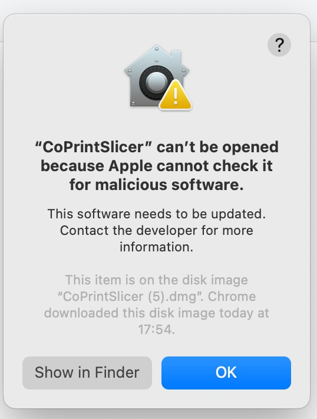
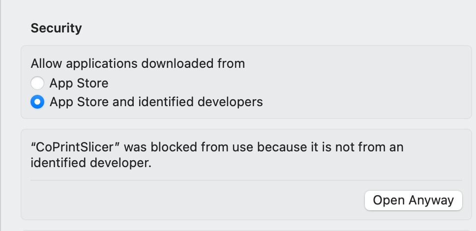
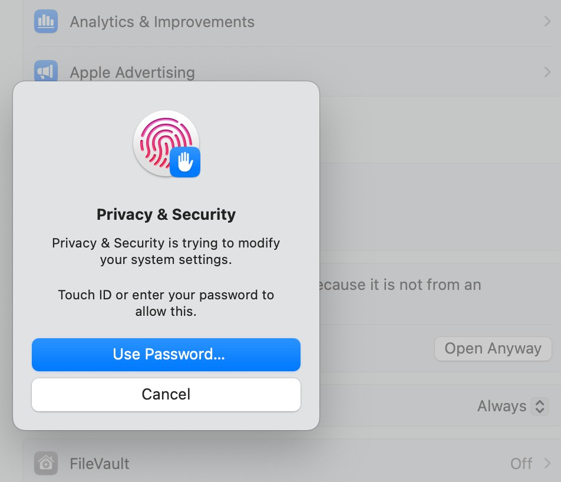
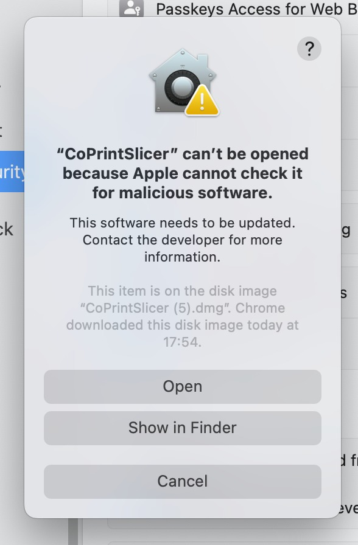

 

CoPrintSlicer: an open source Next-Gen Slicing Software for Precision 3D Prints.
Forked from OrcaSlicer, and built as part of the CoPrint ecosystem to work seamlessly with **Quadro** hardware and hosts.
Optimize your prints with ultra-fast slicing, intelligent support generation, and seamless printer compatibility—engineered for perfection.


# Official links and community


#### Official Website:

[coprint3d.com](https://coprint3d.com/)

#### Quadro:

For detailed information about Quadro, visit [coprint3d.com/pages/quadro](https://coprint3d.com/pages/quadro)

#### GitHub Repository:


> **Note:** A dedicated wiki for CoPrintSlicer and Quadro is not published yet. Once available, it will be linked here and at [wiki.coprint3d.com](https://wiki.coprint3d.com/).


# Download


## Stable Release

📥 **[Download the Latest Stable Release](https://github.com/coprint/CoPrintSlicer/releases/latest)**
Visit our GitHub Releases page for the latest stable version of CoPrintSlicer, recommended for most users.

# How to install


## Windows

Download the **Windows Installer exe** for your preferred version from the [releases page](https://github.com/coprint/CoPrintSlicer/releases).

Troubleshooting

- *If you have trouble running the build, you might need to install the following runtimes:*
- [MicrosoftEdgeWebView2RuntimeInstallerX64](https://github.com/coprint/CoPrintSlicer/releases/download/v1.0.10-sf2/MicrosoftEdgeWebView2RuntimeInstallerX64.exe)
  - [Details of this runtime](https://aka.ms/webview2)
  - [Alternative Download Link Hosted by Microsoft](https://go.microsoft.com/fwlink/p/?LinkId=2124703)
- [vcredist2019_x64](https://github.com/coprint/CoPrintSlicer/releases/download/v1.0.10-sf2/vcredist2019_x64.exe)
  - [Alternative Download Link Hosted by Microsoft](https://aka.ms/vs/17/release/vc_redist.x64.exe)
  - This file may already be available on your computer if you've installed Visual Studio. Check the following location: `%VCINSTALLDIR%Redist\MSVC\v142`


## Mac

1. Download the `arm64` DMG for Apple Silicon.
2. Drag CoPrintSlicer.app to the Applications folder.
3. *If you want to run a build from a PR, or the app is not yet notarized by Apple, you may need to follow the steps below:*
  Quarantine / "can't be opened" warning
  - Option 1 (You only need to do this once. After that the app can be opened normally.):
    - Step 1: Hold *cmd* and right click the app, from the context menu choose **Open**.
    - Step 2: A warning window will pop up, click **Open**.
  - Option 2:
  Execute this command in terminal:
    ```shell
    xattr -dr com.apple.quarantine /Applications/CoPrintSlicer.app
    ```
  - Option 3 (via System Settings):
    - Step 1: Open the app — a warning window will pop up:
      
    
    - Step 2: Go to `System Settings` → `Privacy & Security`, and click **Open Anyway**:
      
    
    - Step 3: Confirm with Touch ID or your password when prompted:
      
    
    - Step 4: In the dialog that appears again, click **Open**:
      
    


## Background

CoPrintSlicer is forked from [OrcaSlicer](https://github.com/SoftFever/OrcaSlicer), which itself is forked from [Bambu Studio](https://github.com/bambulab/BambuStudio) by BambuLab. Bambu Studio is forked from [PrusaSlicer](https://github.com/prusa3d/PrusaSlicer) by Prusa Research, which is from [Slic3r](https://github.com/Slic3r/Slic3r) by Alessandro Ranellucci and the RepRap community.

CoPrintSlicer is developed and maintained as part of the **CoPrint** ecosystem, built to work seamlessly with **Quadro** printer hosts and hardware. For more information about Quadro, visit [coprint3d.com/pages/quadro](https://coprint3d.com/pages/quadro).

# License

- **CoPrintSlicer** is licensed under the GNU Affero General Public License, version 3. CoPrintSlicer is based on OrcaSlicer.
- **OrcaSlicer** is licensed under the GNU Affero General Public License, version 3. OrcaSlicer is based on Bambu Studio by BambuLab.
- **Bambu Studio** is licensed under the GNU Affero General Public License, version 3. Bambu Studio is based on PrusaSlicer by Prusa Research.
- **PrusaSlicer** is licensed under the GNU Affero General Public License, version 3. PrusaSlicer is owned by Prusa Research. PrusaSlicer is originally based on Slic3r by Alessandro Ranellucci.
- **Slic3r** is licensed under the GNU Affero General Public License, version 3. Slic3r was created by Alessandro Ranellucci with the help of many other contributors.
- The **GNU Affero General Public License**, version 3 ensures that if you use any part of this software in any way (even behind a web server), your software must be released under the same license.
- CoPrintSlicer includes a **pressure advance calibration pattern test** adapted from Andrew Ellis' generator, which is licensed under the GNU General Public License, version 3. Ellis' generator is itself adapted from a generator developed by Sineos for Marlin, which is licensed under the GNU General Public License, version 3.
- The **Bambu networking plugin** is based on non-free libraries from BambuLab. It is optional to CoPrintSlicer and provides extended functionality for Bambu Lab printer users.

